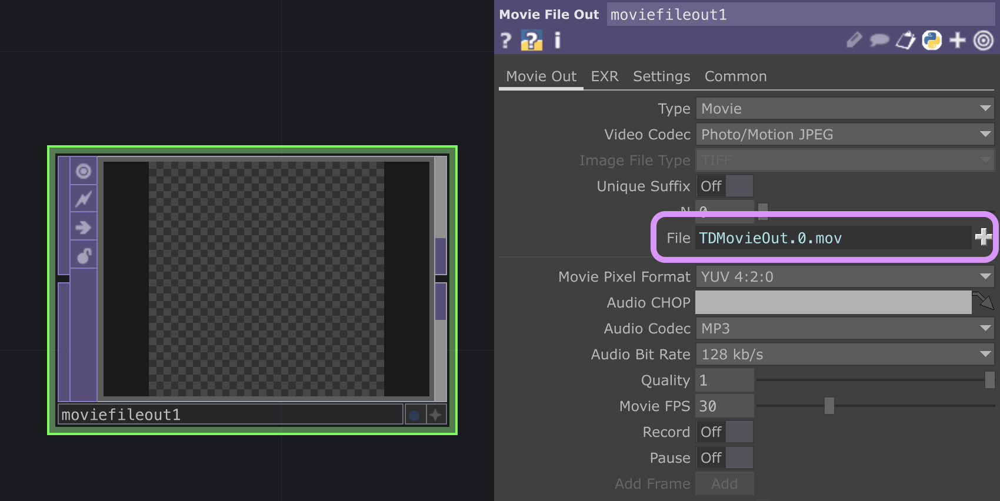
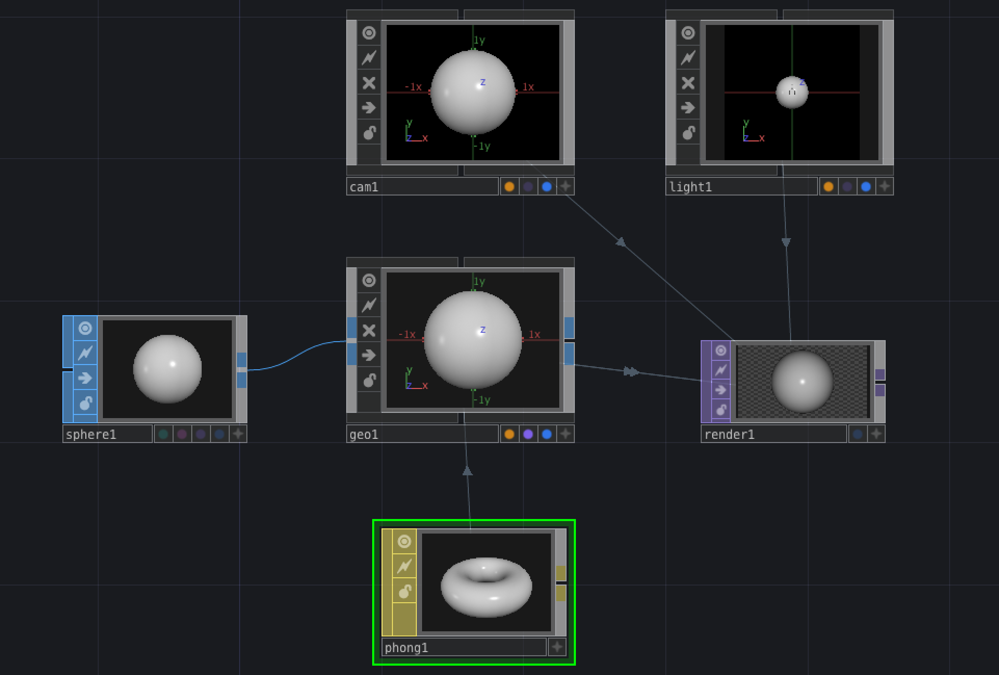

# Touchdesigner intro

[*french version*](https://github.com/LucieMrc/IntroTD_FR)

## Content
* [TouchDesigner ???](#touchdesigner-) 
    * [Inputs and outputs](#Inputs-and-outputs) 
    * [What I do](#What-I-do) 
    * [Interactive stuffs from the digital workshop](#interactive-stuffs-from-the-digital-workshop) 
    * [People doing things](#people-doing-things) 
    * [Interactive stuffs from the digital workshop](#interactive-stuffs-from-the-digital-workshop) 
    * [People doing youtube tutorials](#people-doing-youtube-tutorials) 

* [Understanding TouchDesigner](#understanding-touchdesigner) 
    * [Interface](#Interface) 
    * [Nodes](#nodes) 
    * [Data links](#data-links) 
    * [Quick help!](#quick-help) 

* [Basic actions](#basic-actions) 
    * [Basic `Noise` TOP animation](#basic-noise-top-animation) 
    * [Feedback loop](#feedback-loop) 
    * [Exports](#exports) 
    * [Feedback loop](#feedback-loop) 
    * [Audio-reactive](#audio-reactive) 
    * [Geometry](#geometry) 
    * [Move a circle with the mouse](#move-a-circle-with-the-mouse) 

* [To go further](#to-go-further) 

# TouchDesigner ???

Touchdesigner is a visual programmation langage used to create multimedia interactive content in real time. It is mostly used by artists and programmers to create artwork, performances and installations.

Touchdesigner allow 2D and 3D production, including rendering and composing tools, video and audio inputs and outputs, multi-screens support, video mapping, animation, 3D engine, and programmation tools.

Programming in TD is based on the connexion between different nodes, which all have parameters controling their operations.

Uses : mapping, VJing, spectator/environment/sound-visual interaction

## Inputs and outputs

Inputs :
- sound
- MIDI controller
- datas : OSC, Serial (from Arduino, ...)
- etc

Outputs :
- real-time video (video-mapping, led-mapping, ...)
- datas : OSC, Serial (from Arduino, ...)
- etc

## What I do

[@lucie.mrc](https://www.instagram.com/luciemrc/)

## Interactive stuffs from the digital workshop

*Augmenta laser wall interactive visual*

*Augmenta 3D camera calibration*

*Pixel mapping with 9 leds bars*

*Pixel mapping with a MIDI controler*

## People doing things

[Borischimp504](https://www.instagram.com/borischimp504/) - photogrammetry

[B2bk](https://www.instagram.com/b2bk.fr/) - photogrammetry

[Kaoru Tanaka](https://www.instagram.com/velvet_kaoru/) - generative visuals

[Roelof Knol](https://www.instagram.com/roelofknol/) - interactive installations

[No One's Image](https://www.instagram.com/noonesimg/) - generative visuals

[Karlskene](https://www.instagram.com/karlskene/) - generative visuals with laser and projection

[Simon Alexander-Adams](https://www.instagram.com/polyhop/) - generative visuals

## People doing youtube tutorials

[Bileam Tschepe](https://www.youtube.com/channel/UCONptu0J1PCrW9YfBtSdqjA)

[The Interactive & Immersive HQ](https://www.youtube.com/channel/UC-9DT8kpvykuBEQ2iVatWbA)

[Acrylicode](https://www.youtube.com/@acrylicode)

[Noto the Talking Ball](https://www.youtube.com/@NotoTheTalkingBall)

[Matthew Ragan](https://www.youtube.com/@raganmd)

[Pakita12](https://www.youtube.com/@paketa12)

[PPPANIK](https://www.youtube.com/channel/UCWBbakpo_cATqJy9Dzf9x4w)

[Grady Sain](https://vimeo.com/user1133243)

# Understanding TouchDesigner

## Interface

Network in the middle, palette on the left (you can close it), parameters on the right.

On top, differents little parameters of TD, layout etc, on the bottom, the timeline.

## Nodes

To open the nodes menu, you can either double-click on the background or press tab on your keyboard.

6 categories of nodes :
- COMP (Components), representing different types of controls and various nodes.
- TOP (Texture Operators), allowing operations on 2D images.
- CHOP (Channel Operators), used for animations and audio.
- SOP (Surface Operators), native 3D objects of TD, handling 3D points, polygones, and other 3D primitives.
- MAT (Materials), used to apply materials and shaders on 3D renders.
- DAT (Data Operators), used for texts, scripts and data arrays.

 
 Les nodes les + utilisées 

### COMP : 
- `Geo` + `Camera` + `Light` pour créer un rendu 3D.

### TOP : 
- `Noise` : du random en image 2D, facile à animer
- `Composite` :  mélanger plusieurs images avec différents types d'opérations
- `Level` : modifier la luminosité, le contraste, l'opacité, etc d'une image
- `Lookup` + `Ramp` : récoloriser une image suivant un dégradé de couleurs données
- `Movie File In` : charger une image ou une vidéo dans TD
- `Render` : rendre un objet ou une scène 3D dans une image 2D
- `Transform` : modifier la taille d'une image, sa position, son orientation, ajouter un fond derrière les pixels transparents
- `Movie File Out` : exporter une vidéo

### CHOP : 
- `Audio File In` : charger un son dans TD
- `Constant` : créer des données constantes à utiliser dans le projet
- `Filter` : lisser un flux de données pour éviter les sauts trop hauts ou trop bas dans la courbe
- `Limit` : contraindre un flux de données entre un maximum et un minimum selon différentes opérations
- `Math` : appliquer des opérations mathématiques sur des données
- `Mouse In` : récuperer les positions X et Y de la souris
- `Keyboard In` : récuperer les évenements clavier

### SOP : 
- `Grid` : créer une grille 3D
- `Sphere` : créer une sphère
- `Twist` : plier ou twister un objet 3D selon différentes opérations
- `Text` : créer un objet texte en 3D
- `Transform` : modifier la taille, la position et la rotation d'un objet 3D

### MAT : 
- `Constant` : un matériau d'une couleur constante
- `Line` ou `Wireframe` : un matériau avec juste le contour des polygones
- `Phong` : un matériau avec une color map, une normal map, etc

Each categories have a color, and you cannot connect nodes from different categories. To connect a CHOP to a TOP in your network for example, you can either use a CHOPToTop node or link the parameter you want in the CHOP to a parameter in the TOP. The link will then be a dotted line instead of a full line.

Each node can be customized with a multitude of parameters particular to each, and allow the link of parameters between differents nodes, and to get data from any part of the TD project.

To open the parameters, press 'p'.

## Data links

To connect nodes, you can either do a regular link from one node's output to another node's input, if they are the same type of node (same color).

To get a node to "look at" another node, whether they are the same type (in a `Feedback` TOP for example) or different types (`CHOP to`, `SOP to`, etc), you just need to drag and drop the observed node on the observing node.
You can also drag and drop the observed node (here : `Audio Oscillator` CHOP) in the slot in the parameters of the observing node (here : `CHOP to` TOP), or write its name.

To get some datas from a node (most of the time, CHOPs) into the parameters of another node, you need to first click on the little + at the bottom right of the node, to activate the "Viewer Active" mode. 

The look of the node should change, and you can then drag and drop the channel name into a slot in the parameters of another node. Here the chan1 of an `Audio Oscillator` CHOP, into the period of a  `Noise` TOP. A list of export options appears, you should select "CHOP Reference" as the export to keep it in real time.

You can also write "op('NameOfTheNode')['NameOfTheChannel']" in the parameter.

## Quick help!

To find help quickly about a node that you don't know or don't understand, you can right-click on the node and click `Operator Snippets` to open a Touchdesigner page with one or multiple examples of how to use the node :

You can also click `Help` to open the Touchdesigner documentation page about the node :

# Basic actions

## Basic `Noise` TOP animation

To animate a `Noise` TOP, you can write "absTime.seconds" in the Translate parameters of the Transform tab in the parameters.

You can make it scroll horizontally in translate X, scroll vertically in the translate Y, and the best results are often with translate Z (when the noise type is 3D or 4D).

## Feedback loop

The basic feedback loop network : one texture TOP, going to a `Feedback TOP`, going to a modifier TOP (level, blur, etc), going to `Composite TOP` with the texture TOP.

In the parameters of the `Feedback TOP`, we drag and drop the `Composite TOP` in the Target TOP slot, to have the grey arrow link between the TOPs closing the loop.

In the parameters of the `Level TOP`, in the Post tab, we set the opacity to a lower value like 0.9, to decrease the opacity of the layers as they go through the feedback loop.

In the parameters of the `Composite TOP`, we chose a operation mode like Add, or Atop.

My tutorial about [using the Feedback TOP](https://github.com/LucieMrc/TD_feedback_love_EN).

## Exports
To export a .mov video : create a `Movie File Out` TOP at the very end of your network, chose a name and a place for the file in the file slot. To start a recording, activate the Record button in the parameters, and deactivite the Record button to stop the recording.

You can and should uncheck "Realtime" in the middle of the top menu, so your video doesn't skip frames if TD start lagging. 

To send the video on a media server, create a `Syphon/Spout Out` TOP at the very end of the network.

## Audio-reactive

Create an `Audio File in` CHOP, in the parameters you can active Mono to have one channel instead of a stereo sound.

You can put your own sound or keep the example one from TD. 

Link it to a `Math` CHOP, go to the tab Range, change the From Range, I put -0.7 and 0.7 because it's the range I see on my CHOP. 

Then change the To Range, I put 0.2 and 0.3 because it looked best.

Click on the little cross on the bottom right of the node to activate the active viewer.

Create a `Circle TOP`, in the parameters Radius X and Y, drag and drop the chan1 from the `Math TOP`, and select CHOP Reference in the slot.

## 3D render

To create a basic 3D geometry network, you need 5 nodes.
- a SOP of your choice
- a `Geometry COMP`
- a `Camera COMP`
- a `Light COMP`
- a `Render TOP`
- a MAT of your choice

You start by creating a SOP of your choice, here a `Sphere SOP`. 

Create a `Geomtry COMP` by dragging directly the out link of the Sphere and hitting tab.

The sphere should appear in the Geo. Create a `Camera COMP` and a `Light COMP`, then a `Render TOP`. Grey arrow links should appear between the three COMP and the render.

Then create a MAT of your choice, here a `Phong MAT`, and drag it on the `Geometry COMP`, and select Parm: Material.

### Apply a 2D texture as a 3D material

With the `Phong` MAT, you use any TOP as a texture for the material by dragging and dropping the TOP on the "Color Map" parameters of the `Phong`.

## Move a circle with the mouse

Create a `Mouse In` CHOP.

Create a `Circle` TOP, set the radius to something smaller like 0.05, and the resolution to something bigger like 1280*720.

Connect it to a `Transform` TOP.

In the `Transform` TOP parameters, drag and drop "tx" from the `Mouse In` CHOP in the Translate X parameter, and do the same for "ty".

If the circle isn't matching exactly the position of the cursor, we can remap the position so it matches the resolution of the image.

Add two `Select` CHOP after the `Mouse In`, and choose tx and ty in "Channel Names" in each `Select`, to have a CHOP for each channel.

Add a `Math` CHOP after each `Select` and go to the "Range" tab of the parameters.

Most of the time, the position tx of the mouse will go from -1 (left side of the screen) to 1 (right side), and ty will go from around -0.6 (bottom of the screen) to 0.6 (top of the screen). You want to "From Range" to be these values in each `Math` CHOP.

You can then arrange the "To Range" value by moving your mouse to the edges of the display of the `Transform` TOP, and setting the range to a value where the circle center position match your cursor position around the edges and in the middle of the display.
I used -0.6, 0.6 for tx and -0.7, 0.7 for ty.

The Range tab in a `Math` CHOP works by giving the current minimum and maximum of a value, and the new minimum and maximum that you chose, so the value is recalculated proportionally.

# To go further

- [Audioreactive visual in TD (EN)](https://github.com/LucieMrc/TD_audioreact_love_EN)

- [Feedback loop in TD (EN)](https://github.com/LucieMrc/TD_feedback_love_EN)

- [Using Kantan for video-mapping in TD (EN)](https://github.com/LucieMrc/TD_KantanMapper)

- [Photogrammetry in TD (FR for now)](https://github.com/LucieMrc/Photogrammetrie)

- [Using Augmenta with TD (EN)](https://github.com/LucieMrc/TD_Augmenta)

- [Touchdesigner ressources from the MIR lab](https://mir.works/learning-resources) (advanced)